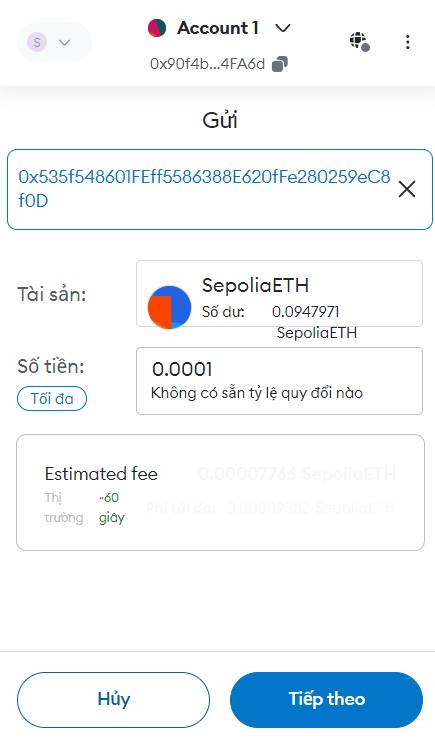

### How to run source
In folder /dev . Run all service by following command \
> `cd dev` \
`docker-compose up`

*** You can import portman API (Parser_API.postman_collection.json) to easily trigger

### Source Definition
- I have 2 part (api and worker) in the same code base to make it easy for scalable
- Restrict 5 Worker to gather data for subcribers

### Working Time Total
~ 16h including research about block, metamarks , address , transaction , v..v..

### API
There are some exported api by api service
1. GET: http://localhost:8080/subscribes \
=>  Get monitoring address list
> Example: curl --location 'localhost:8080/subscribes'
2. POST: http://localhost:8080/subscribe  \
=> Subscribe an address
> Example: curl --location 'localhost:8080/subscribe' \
   --header 'Content-Type: application/json' \
   --data '{
   "address": "0x535f548601FEff5586388E620fFe280259eC8f0D"
   }'
3. POST: http://localhost:8080/unsubscribe \
=> UnSubscribe an address
> Example: curl --location 'localhost:8080/unsubscribe' \
   --header 'Content-Type: application/json' \
   --data '{
   "address": "0x535f548601FEff5586388E620fFe280259eC8f0D"
   }'
4. GET: http://localhost:8080/transaction \
=> Get all transaction related to address since subscribe time
> Example: curl --location 'localhost:8080/transactions?address=0x90f4b3Fac242082662DD4f80793141fb35e4FA6d'

5. GET: http://localhost:8080/current-block
=> Get current block number
> Example: curl --location 'localhost:8080/current-block'

### Demo
1. Subscribe address `0x535f548601FEff5586388E620fFe280259eC8f0D`

2. Send token from `0x90f4b3Fac242082662DD4f80793141fb35e4FA6d` to `0x535f548601FEff5586388E620fFe280259eC8f0D`

3. Check transaction history

4. Unsubcribe an address

5. Get transaction again

